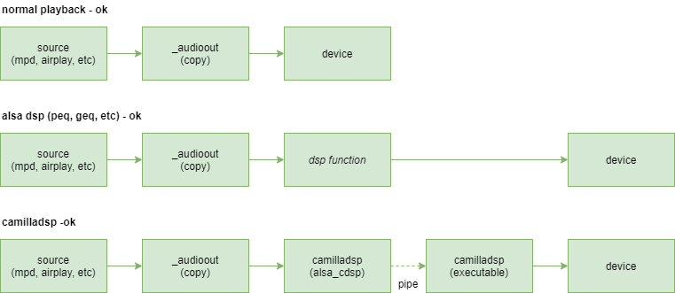
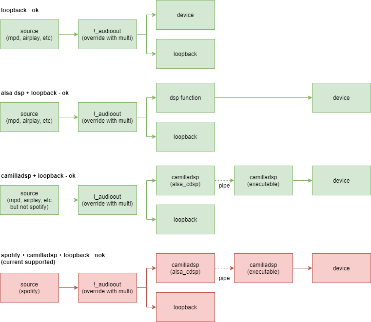

moOde Audio Infrastructure <!-- omit in toc -->
===============================================
By: @bitlab (c) 2021
Updated: 2022-03-10

This document describes the audio infrastructure of moOde audio player.

### Table of Contents <!-- omit in toc -->

- [1. Introduction](#1-introduction)
- [2. The audio chain](#2-the-audio-chain)
- [3. ALSA Digital Signal Processing (DSP) components](#3-alsa- digital-signal-processing-dsp-components)
  - [3.1. ALSA DSP components](#31-alsa-dsp-components)
  - [3.2. MPD integrated DSP](#32-mpd-integrated-dsp)
- [4. The audio path](#4-the-audio-path)
  - [4.1. ALSA default](#41-alsa-default)
  - [4.2. ALSA loopback](#42-alsa-loopback)

# 1. Introduction

moOde audio player is based on the Music Player Daemon (MPD) music server/renderer and the Advanced Linux Sound Architecture (ALSA). MPD provides a music collection tag database, audio format decoding and playback and much more. ALSA provides a low latency, direct interface between audio output and the audio device.

In addition there are several other audio renderers integrated into moOde including Bluetooth, Airplay, Spotify Connect, Squeezelite and optionally RoonBridge. These enable playback from a wide variety of music sources.

Lastly, a UPnP proxy client for MPD is integrated into moOde. This enables certain non-free music services to use moOde as an audio renderer with middleware like Bubble UPnP.

# 2. The audio chain

The image below shows a high level view of the audio infrastructure.

The blue blocks are possible audio sources. The first three sources are inputs to MPD and have the most features. Second are Spotify and Airplay. Bluetooth, LMS Client and Roon Bridge, can only be used the configured audio device, moOde doesn’t provide any DSP options for those. LMS an Roon provide there own DSP functions.

# 3. ALSA and MPD Digital Signal Processing (DSP) components

When activating an ALSA DSP component only one can be active at a time. If different types of DSP are required in a single pipeline then CamillaDSP can be used.

## 3.1. ALSA DSP components

- Crossfeed with several modes available
- Invert polarity
- 10 band graphical EQ (Alsaequal)
- 12 band parameteric EQ (custom 12 bands based on caps EqFa4p).
- CamillaDSP (powerful, flexible DSP with pipeline editor)

## 3.2. MPD integrated DSP

MPD provides a powerful SoX resampler that supports custom SoX recipoes and moOde's custom Selective Resampling option. This option allows automatic engagement of resampling based on the sample rate of the source.

- Upsample if source < target rate
- Upsample only 44.1K source rate
- Upsample only 44.1K and 48K source rates
- Resample (adhere to base freq)
- Upsample if source < target rate (adhere to base freq)

# 4. The audio path

The diagrams below provide an overview of the path audio has to take from source to device.

## 4.1. ALSA default

The default is to use ALSA plughw to output to a device. Plughw provides automatic sample rate and bit depth conversion if needed to meet the capabilities of the device. For example if the audio format is 16-bit and the device only acceots 32-bit the plughw plugin will automaatically zero-pad the bit depth to 32-bit.

Optionally ALSA hw can be used to output to the device. No automatica conversions are performed. If the audio device does not accept the format being output a playback error will be thrown.

## 4.2. ALSA loopback

The output PCM stream can be duplicated and routed to a Loopback device for consumption by other applications for example VU meters or a Multiroom sender daemon.

Below is the alsa configuration when Loopback is on.

In this case ALSA plughw is always used, mainly to correct bitdepth when required. Notice that the last configuration isn’t supported for now.
